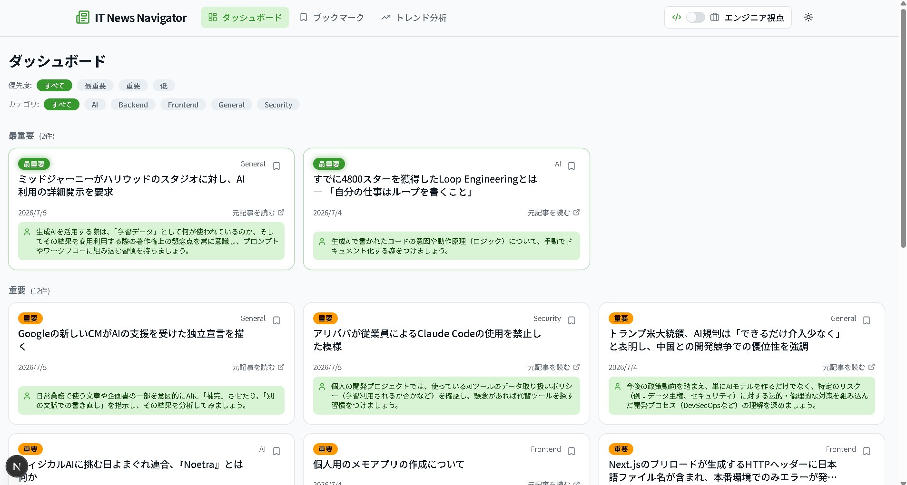
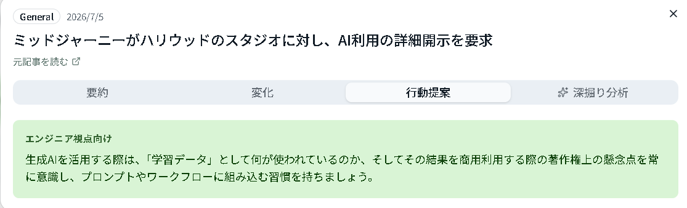
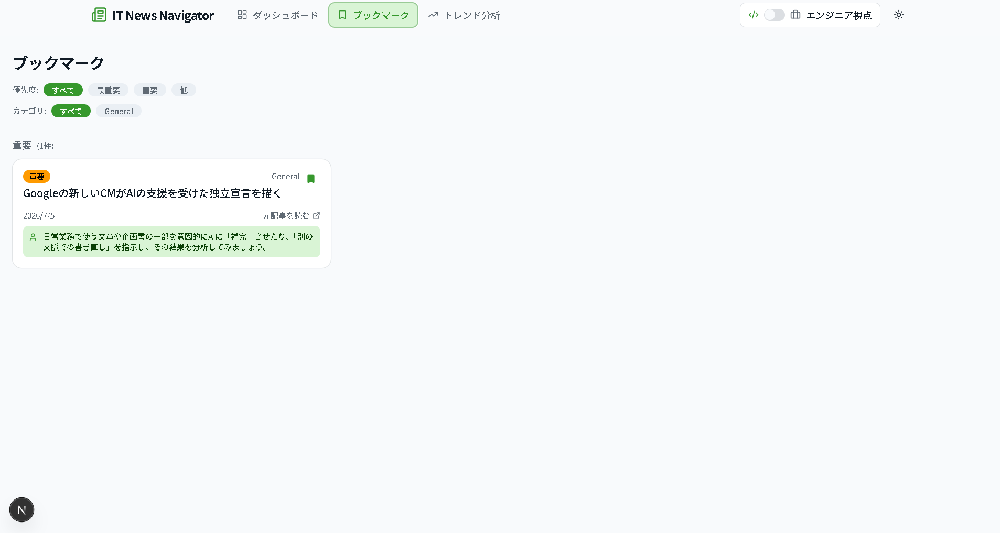
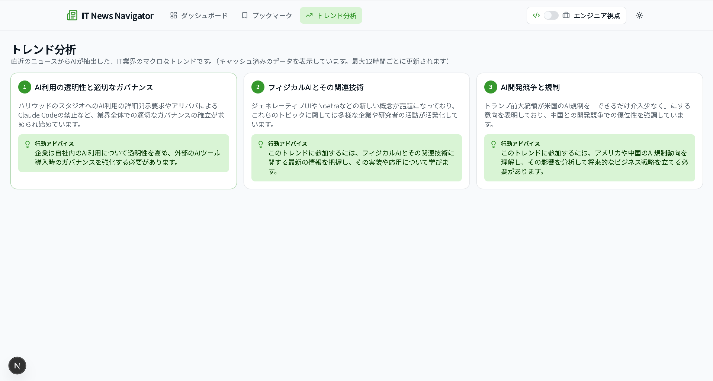
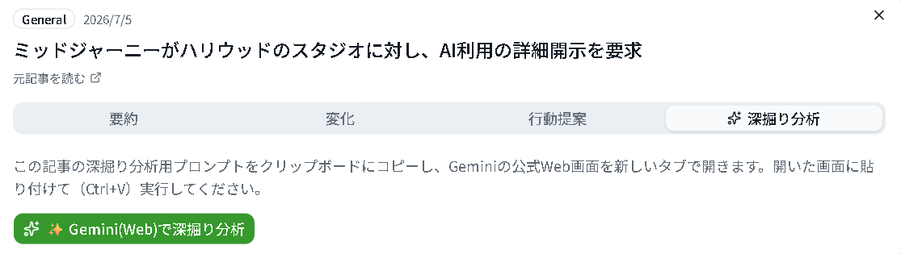
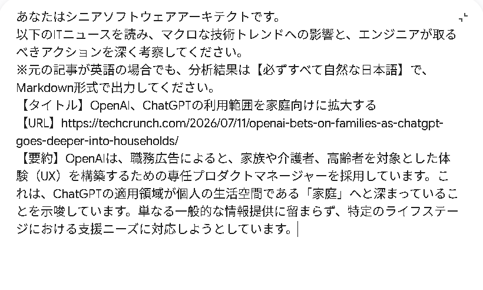

# IT News Navigator

IT/AI関連ニュースを自動収集し、AIが要約・分析・行動提案までを生成する意思決定支援ダッシュボードです。

---

## ① 概要

IT/AIニュースをRSSで自動収集し、ローカルAIが要約・優先度判定・行動提案を生成して一覧表示するWebアプリです。

情報収集や整理に時間を奪われず、利用者が「何をすべきか」の判断に集中できる状態を作ることを目的としています。

---

## ② 課題（背景）

- **業界課題**：AI/IT分野の情報発信量は増え続け、個人が全てを追い切るのは非現実的になっています。
- **個人課題**：情報収集・整理に時間を取られ、内容を咀嚼して行動に落とし込む時間が不足します。
- **業務課題**：ヘルプデスク業務でも、日々の情報キャッチアップと社内共有に時間がかかっていました。
- **解決**：収集・要約・優先度判定・行動提案までを自動化し、人は判断と行動だけに集中できるようにしました。

---

## ③ スクリーンショット

### ダッシュボード



- **できること**：優先度（最重要/重要/低）とカテゴリでニュースをフィルタし、セクション別に一覧表示します。
- **価値**：全記事を読まなくても、重要な情報だけを数秒で把握できます。
- **裏側処理**：RSSで収集した記事をAIが要約・優先度判定し、DBへ保存した結果を表示しています。

### 記事詳細



- **要約 / 変化 / 行動提案**：何が起きたか・何が変わったか・どう動くべきかをタブで分離して提示します。
- **意思決定への活用**：行動提案タブを確認するだけで、次に取るべきアクションを判断できます。
- **AI処理内容**：ローカルLLMが記事本文から3種のアウトプットを構造化JSONで生成します。

### ブックマーク



- **ユーザー操作**：気になる記事をワンクリックで保存し、専用画面から後で見返せます。
- **状態管理**：Zustandでブックマーク状態をクライアント側管理し、画面間で即座に反映します。

### トレンド分析（必須）



- **できること**：直近の記事群からAIが業界のマクロトレンドを3件に抽出します。
- **ユーザー価値**：個別記事を読まずに、業界の流れを短時間で把握できます。
- **裏側処理**：直近記事の要約群をAIに入力してトレンド抽出し、12時間キャッシュで再計算を抑制します。

### 深掘り分析（最重要）




- **役割**：ローカルAIでは扱いきれない、より高度で踏み込んだ分析を行います。
- **意思決定への貢献**：精度の高い分析結果を踏まえた、質の高い判断が可能になります。
- **外部AIとの連携**：分析用プロンプトをコピーしGemini公式Web画面に貼り付ける「プロンプト・ハンドオフ」方式で、アプリ側の従量課金なしに実現しています。3サービス（ChatGPT/Gemini/Claude）から選択可能で、掲載画像はChatGPT選択時の例です。

---

## ④ システム概要

**RSS収集 → API処理 → ローカルAI（要約・優先度判定・行動提案） → DB保存 → ダッシュボード表示**

クローラーがRSSから記事を取得し、AIの分析結果をSupabaseへ保存、UIはそのデータを描画するだけの構成です。

---

## ⑤ 技術構成（役割ベース）

| 技術 | 役割 |
|---|---|
| Next.js | UI構築・画面表示 |
| Node.js | API処理・データ加工（クローラー/Route Handler） |
| Supabase | データ保存・管理（PostgreSQL + RLS） |
| Ollama | ローカルAI分析（要約・優先度判定・行動提案） |
| Gemini | 高度分析（深掘り分析のハンドオフ先） |

---

## ⑥ API・データ設計

- **記事取得API**：`lib/api/articles.ts`（Server Action）が優先度→更新日時順で記事一覧を取得します。
- **トレンド生成API**：`/api/trends`（Route Handler）が直近30件の要約をAIへ渡し、トレンドを生成・キャッシュします。

`articles` テーブルの主要カラム：

| カラム | 意味 |
|---|---|
| `summary` | AIが生成した記事要約 |
| `trend_diff` | 記事が示す「変化点」の解説 |
| `action_individual` / `action_enterprise` | エンジニア視点 / ビジネス視点の行動提案 |
| `category` | AI/Cloud/Frontend/Backend/Infrastructure/Security/General の分類 |
| `priority_label` | 表示優先度（High/Mid/Low） |
| `importance` | AI推論による重要度スコア（1〜5、並び替えの補助値） |

読み取りはanon keyで許可し、書き込みはservice_role（クローラー）のみに限定するRLS構成です。

---

## ⑦ 技術的な工夫

- **AI出力の不安定さ対策**：Ollamaへの `format: "json"` 指定に加え、前後の余分なテキストからJSON本体だけを抜き出す `extractJson` で構造化出力を担保しています。
- **API課金回避**：日常の要約・優先度判定・行動提案は全てローカルLLM（Ollama）で処理し、アプリ運用コストをゼロに保っています。
- **GeminiとOllamaの使い分け**：日常分析はローカルAI、より高度な分析が必要な深掘り分析だけをプロンプト・ハンドオフでGeminiへ委譲し、コストと分析品質を両立しています。
- **キャッシュ・負荷対策**：`/api/trends` は12時間のメモリキャッシュを持ち、Ollamaへの呼び出し回数を抑制。生成失敗時は直前キャッシュへフォールバックします。
- **マルチAIハンドオフ (Multi-AI Handoff)**：高度な深掘り分析を外部の高性能LLMに委譲する際、特定モデルへの依存（ベンダーロックイン）を避けるため、「ChatGPT / Gemini / Claude」から連携先をシームレスに切り替えられるアーキテクチャを採用。ユーザーの選択状態はZustand(persist)により永続化され、毎回選ぶ手間（トイル）を排除したUXを実現（本セクション内の「GeminiとOllamaの使い分け」の記述は開発初期の構成であり、現在はこのマルチAIハンドオフに置き換わっています）。
- **記事本文の抽出精度と重複記事対策（Python統合）**：RSSフィードのスニペットのみに頼っていたため記事本文の情報量が薄く、複数ソースから同じニュースが重複表示されることもあった課題に対し、Pythonの`trafilatura`による本文抽出、`rapidfuzz`によるあいまい一致での重複検出を導入し、Node.jsのクローラーからサブプロセスとして呼び出す設計にしました。既存のTypeScript処理へのフォールバックも用意し、非対話的実行環境（タスクスケジューラ）でも同様に動作することを検証済みです。
- **ダッシュボードの視認性改善（過去ニュース分離）**：記事が蓄積するにつれダッシュボードの一覧が見づらくなった課題に対し、直近1週間の記事のみをダッシュボードに表示し、それ以前の記事は専用ページ（`/archive`）に分離しました。既存の優先度ソート・カテゴリフィルター・ブックマーク機能はそのまま維持しています。

---

## ⑧ 自分の担当

要件定義・システム設計・実装・動作検証まで、個人開発で一貫して担当しました。

---

## ⑨ 課題と解決

- **問題**：当初採用していた`llama3.1:8b`で、日本語のみの記事において低頻度で同一文字列を無限反復する出力崩壊が発生しました。
- **解決**：`gemma4:e4b-it-q4_K_M`へモデルを切り替え、自動リトライと英語混入検知による再翻訳を組み込み安定運用を実現しました。

---

## ⑩ 技術選定理由

- **Next.js**：Server Components / Client Componentsを分離しつつ、UIとAPI処理を1つのフレームワークで完結できるため。
- **Supabase**：無料枠でPostgreSQLとRLSが使え、アプリ運用コストをゼロに保てるため。
- **Ollama**：ローカル実行によりAPI従量課金なしで、大量記事の要約処理を継続的に回せるため。

---

## ⑪ ビジネス価値

- 社内マニュアル検索、議事録分析、問い合わせ履歴分析など、社内ナレッジ活用へ応用できます。
- 情報収集・共有にかかる時間を削減し、意思決定のスピードを上げる業務改善に貢献します。

---

## ⑫ 今後の拡張

- AIエージェント化（行動提案の自動実行）
- Microsoft 365連携

---

## ⑬ GitHubリンク

[github.com/nixon1140-cpu/it-news-app](https://github.com/nixon1140-cpu/it-news-app)

---

## セットアップ（開発者向け）

### 1. 依存関係のインストール

```bash
npm install
```

### 2. 環境変数（`.env.local`）

```bash
NEXT_PUBLIC_SUPABASE_URL=あなたのSupabaseプロジェクトURL
NEXT_PUBLIC_SUPABASE_ANON_KEY=anon key

# サーバー/バッチ専用（NEXT_PUBLIC_を付けずクライアントバンドルへの漏洩を防止）
SUPABASE_URL=あなたのSupabaseプロジェクトURL
SUPABASE_SERVICE_ROLE_KEY=service_role key（クローラーのUPSERT専用。絶対にクライアントに公開しないこと）
```

DBスキーマは `supabase/schema.sql` を参照し、SupabaseのSQL Editorで実行してください。

### 3. Ollama（ローカルLLM）のセットアップ

1. [ollama.com](https://ollama.com/download) からインストール
2. 使用モデルをpull

   ```bash
   ollama pull gemma4:e4b-it-q4_K_M
   ```

3. Ollamaを起動しておく（`ollama serve`、または常駐アプリとして起動）

#### モデル選定について

現在のクローラーは `gemma4:e4b-it-q4_K_M` を使用しています。当初 `llama3.1:8b` を採用していましたが、日本語のみの記事（翻訳ではなく要約のみが必要なケース）で低頻度に出力が同一文字列の無限反復ループへ陥り破綻する不具合が実機で確認されたため、同じ条件で安定した日本語品質と高速性を両立した `gemma4:e4b-it-q4_K_M` に切り替えました。

### 4. 開発サーバーの起動

```bash
npm run dev
```

[http://localhost:3000](http://localhost:3000) を開いてください。

## クローラー（ニュース自動収集バッチ）

```bash
npm run crawl
```

RSSフィード（Zenn/Qiita/はてなブックマーク/Google AI Blog/ITmedia AI+/TechCrunch AI）から記事を取得し、Ollamaで要約・優先度・行動提案を推論してSupabaseへUPSERTします。30日以上前の記事は自動的に除外されます。

Windows起動時に自動実行させたい場合は、タスクスケジューラで以下を設定してください。

- **Ollama起動タスク**: 起動時トリガーで `ollama serve` を実行するバッチファイルを登録（`OLLAMA_MODELS` 環境変数をバッチ内で明示的に設定することを推奨。Machine環境変数だけに依存すると、Ollamaの実行ユーザー（SYSTEM等）によっては反映されないことがあります）
- **クローラー実行タスク**: サインオン時などのトリガーで `npm run crawl` を実行

### クローラーのトラブルシューティング

| 症状 | 原因 | 対処 |
|---|---|---|
| `Ollamaに接続できません` | Ollamaが起動していない | `ollama serve` を実行、または自動起動タスクを確認 |
| `Ollama API エラー: 404 Not Found` | 指定モデルが見つからない、または `OLLAMA_MODELS` のパスがズレている | `ollama list` でモデル一覧を確認。`OLLAMA_MODELS` 環境変数が実際のモデル格納フォルダを指しているか確認 |
| `Ollama API エラー: 500 Internal Server Error`（`llama-server binary not found` 等） | Ollama本体のインストールが不完全・破損している | [ollama.com](https://ollama.com/download) からインストーラーを再ダウンロードし、上書きインストール（修復）を実行 |
| 記事の一部が文字化け・支離滅裂な日本語になる | ローカルLLMの非決定性による低頻度の生成崩れ | クローラーは自動リトライ（最大2回）と英語混入検知＋再翻訳を行いますが、稀に残る場合はモデル自体の品質限界です |

## 本番環境への展開

このアプリはローカルLLM（Ollama）に依存しているため、Vercel等のサーバーレス環境へそのまま全機能をデプロイすることはできません。用途に応じて以下のいずれかを選んでください。

### A. 自宅（ローカルPC）で常時運用する（推奨・現状の構成に忠実）

このPC上でアプリとOllama・クローラーをすべて動かし続ける方式です。

```bash
npm run build
npm run start
```

- 同一LAN内から見る場合はこのPCのIPアドレス＋ポート（既定3000）でアクセスできます。
- 社外・他拠点からも見せたい場合は、ポート開放の代わりに [Cloudflare Tunnel](https://developers.cloudflare.com/cloudflare-one/connections/connect-networks/) 等の無料トンネルサービスで公開すると安全です。
- クローラー（`npm run crawl`）とOllamaはこれまで通りタスクスケジューラでこのPC上に常駐させます。

### B. Vercel無料枠 + Supabaseでダッシュボード部分のみ公開する

`/`（ダッシュボード）・`/bookmarks`・記事詳細は、事前にSupabaseへ保存済みのデータを読むだけなので、Vercelにそのままデプロイできます。ただし **`/trends`（AIトレンド分析）は、リクエスト時にOllamaへ直接アクセスする実装のため、Vercel上では動作しません**（VercelからこのPCのOllamaには到達できないため）。Bも運用する場合は、トレンド生成をクローラーバッチ側で事前計算してSupabaseに保存する方式へ変更する対応が別途必要です（現状未実装）。

## 営業・第三者へのレビュー

実際の画面を見てもらう場合は、まず **`/`（ダッシュボード）** を見てもらってください。ニュースの優先度・カテゴリ分類、AIによる行動提案の見え方が一番伝わりやすいページです。次点で `/trends`（AIトレンド分析）、`/bookmarks`（ブックマーク一覧）の順にご案内すると良いです。

## セキュリティに関する補足

`.env.local`（SupabaseのURL・APIキーを含む）は `.gitignore` で除外されており、これまでGitの履歴にコミットされたことはありません。GitHub上のこのリポジトリからDBの接続情報が漏れることはありません。

## 技術スタック

Next.js 16 (App Router / Turbopack) / TypeScript / Tailwind CSS / shadcn/ui / Supabase / Zustand / Ollama
